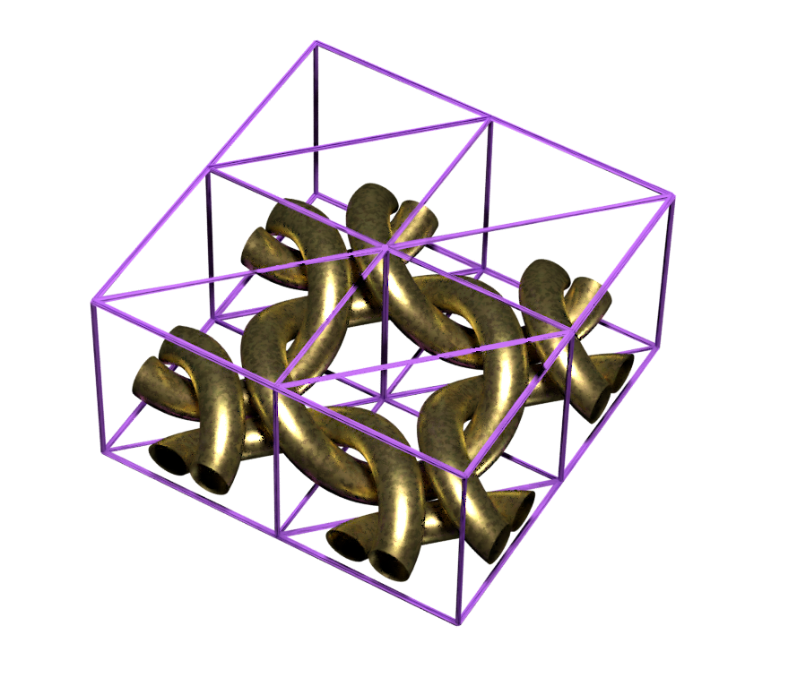

# Blender-geopattern
Study project: the main goal of this project was to learn how real production-ready gpu raytracers formulate images and to add a new unsupported feature to the pipeline of such a raytracer. This feature should work on gpu during the ray-mesh intersection stage.
*If you are looking for production-ready solution, take a look at [Fstorm](https://fstormrender.ru) or [Centileo](www.centileo.com) (in the future). The current implementation has its own limits and bugs/artifacts that don't allow to use it in any kind of production*

[Geopattern](https://fstormrender.ru/manual/geopattern/) can be described as a facility for using meshes in the same way as textures, allowing us to create new objects by spreading (mapping) one object onto the surface of another one.
The same way as instansing does - without a significant increase in memory consumption. You will still have the same number of meshes in the scene, it just changes the way each ray intersects with it.

# Examples (all the images are clickable):
*Note: the texture coordinates for mapping were automatically generated in all the examples, the cropboxes created manually. More about these magical words [here](https://fstormrender.ru/manual/geopattern/) (we use same the terminology)*

Starting from the simple one to explain how it works. Having a piece of a chain and a sphere it can a create sphere fully covered by the chain:
| *Patch* of a chain  |  Simple sphere |
|-------------------------|------------------------------|
  |  

|Result| 
|:--:| 
|  |

The same piece of the chain (436K triangles) was spread across a t-short model (4377 triangles). The armor was created using with this feature. It took ~25MB of memory to store all the meshes during the rendering process whereas without it would have taken ~53GB of VRAM 
(assuming that each triangle was covered with a fully detailed chain)
|The armor created using the feature. To store the mesh without it would be cost 53GB of VRAM | 
|:--:| 
|  |

|A close look-up | 
|:--:| 
|  |

| Grass over a mountain (landscape is 67K triangles, grass is 50K) ~3.9MB VRAM of the storing mesh. 9.7GB without the feature | 
|:--:| 
|  |
|  |

| Fibers example | 
|:--:| 
|  |
|  |

| Utah teapot, a torus and fibers were used for the mapping | 
|:--:| 
|  |
|  |
|  |
